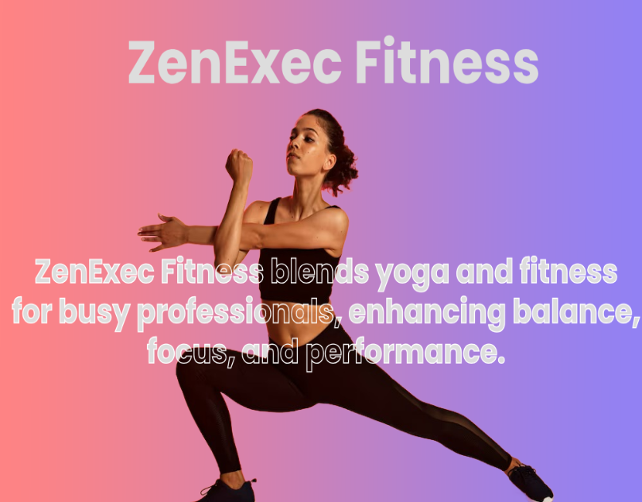
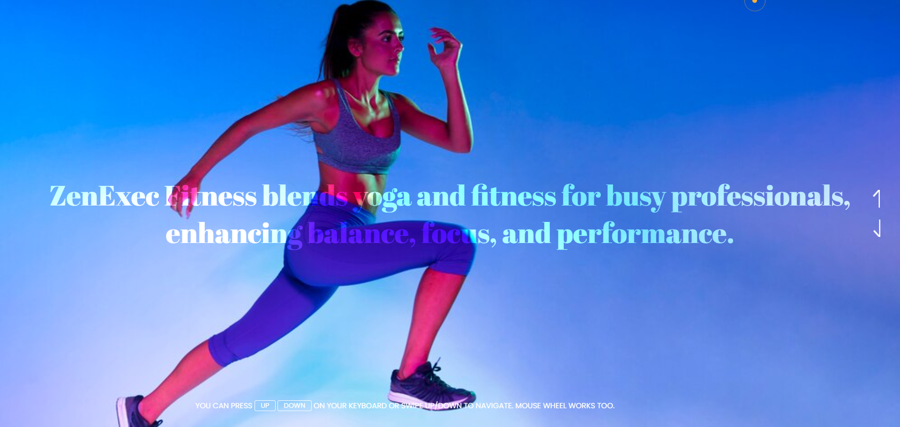
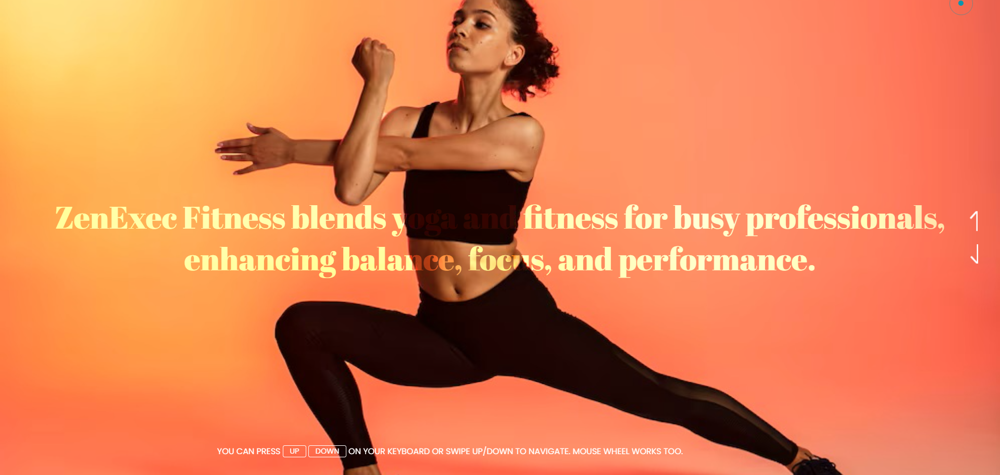

# ZenExec Fitness | Executive Yoga & Wellness for Peak Performance

<a href="https://www.linkedin.com/in/dharmendraverma95/" target="_blank">LinkedIn Profile </a>

<a href="https://www.behance.net/dhirukumar" target="_blank">Behance Profile </a>

ZenExec Fitness | Executive Yoga & Wellness for Peak Performancea simple Hero Banner slider effect, you can use HTML5, CSS3, and JavaScript. Here's an example of how to implement a basic image slider with a smooth transition effect

### Features
<ul>
  <li>img Animation.
</li>
  <li>Smooth Transitions.</li>
</ul>

# Preview

 

 
cover 

 
element 

 
###### Lang
<ul>
  <li>HTML5</li>
  <li>CSS3</li>
  <li>JavaScript</li>
</ul>

